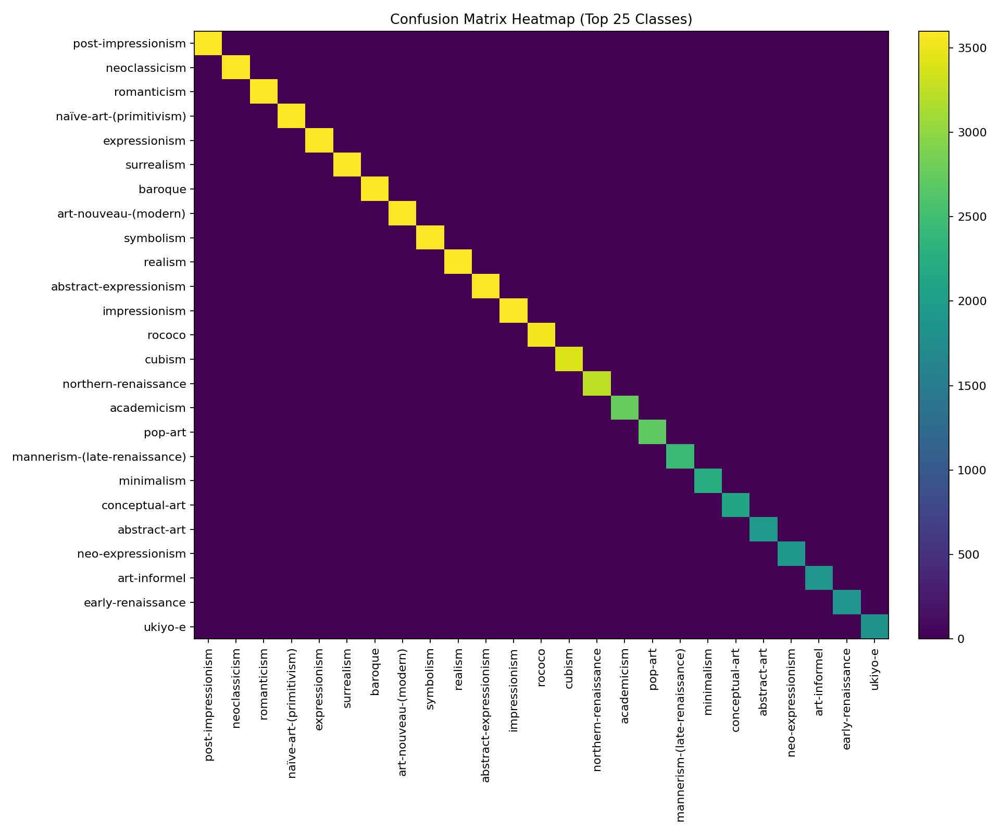

🎨 ArtGenie – Personalized Artwork & Style ML

ArtGenie is a mini-suite for art style ML + generation:

Text-only style classifier (sklearn + Keras) trained from your CSV

Prediction + evaluation (confusion heatmap, accuracy curve)

Text-to-image generator (Stable Diffusion with style presets)

Paths in this README assume Windows & your layout:

Data CSV: C:\Users\sagni\Downloads\Art Genie\archive\wikiart_scraped.csv

Artifacts/output: C:\Users\sagni\Downloads\Art Genie\

📦 Project Contents

artgenie_train_and_plot.py → trains classifiers and saves plots (accuracy & confusion heatmap)

artgenie_predict_and_plot.py → CLI + notebook-safe predictions + plots

artgenie_predict_notebook_safe.py (optional) → pure Jupyter version (no CLI)

artgenie_generate.py → prompt-to-image (Stable Diffusion via Diffusers)

Artifacts produced under C:\Users\sagni\Downloads\Art Genie\:

artgenie_textclf.pkl → sklearn TF-IDF + LogisticRegression + LabelEncoder

artgenie_textclf.h5 or artgenie_textclf.keras → Keras text classifier

label_mapping.json → index → class name

metrics.json → train/val metrics

artgenie_config.yaml → config + hyperparams

sample_predictions.csv → sample validation predictions

history.csv → Keras training history

accuracy_curve.png → train/val accuracy plot

confusion_matrix_full.csv → full confusion matrix

confusion_heatmap_top25.png → top-25 classes heatmap

🛠️ Environment Setup
Python

Use Python 3.10–3.11 (Windows).

Core packages (ML)
pip install numpy pandas scikit-learn==1.5.1 joblib matplotlib pyyaml
pip install tensorflow  # or tensorflow-gpu (if CUDA GPU with TF support)

If TensorFlow install is heavy, you can skip Keras training and use only the sklearn model (PKL). The scripts handle that, but Keras features (history/val metrics) require TF.

Diffusers (image generation)

Pick one route:

A) Upgrade PyTorch (latest Diffusers ok)

# CPU only
pip install --upgrade torch torchvision torchaudio --index-url https://download.pytorch.org/whl/cpu

# OR: NVIDIA GPU (CUDA 12.1)
pip install --upgrade torch torchvision torchaudio --index-url https://download.pytorch.org/whl/cu121

pip install --upgrade diffusers transformers accelerate safetensors pillow

B) Keep older Torch, pin Diffusers

pip install "diffusers==0.27.2" "transformers>=4.41" "accelerate>=0.31.0" safetensors pillow

If you see AttributeError: torch.library has no attribute custom_op, you’re on older Torch with a newer Diffusers. Do A or B above.

📑 Input Dataset (CSV)

Your CSV at:

C:\Users\sagni\Downloads\Art Genie\archive\wikiart_scraped.csv

Expected columns (any subset is fine):

Text features: title, description, caption, tags, genre, style, artist, movement, about, text, materials, subject

Label (preferred order): style → genre → artist → label

The scripts auto-pick the label column (prefers style).
Text is built by concatenating available text columns.
Very rare classes (default < 8 samples) are filtered to stabilize training.

🚀 Train + Plots (accuracy & heatmap)

Run:

python artgenie_train_and_plot.py

What it does:

Reads your CSV

Builds text inputs & label

Trains sklearn (TF-IDF + LogisticRegression) → saves artgenie_textclf.pkl

Trains Keras text classifier → saves .h5 (or .keras, see note below)

Exports:

history.csv, accuracy_curve.png

confusion_matrix_full.csv, confusion_heatmap_top25.png

metrics.json, artgenie_config.yaml, sample_predictions.csv, label_mapping.json

Keras save format tip (prevents a TF table bug)

If you hit a TextVectorization table not initialized error on inference, save the Keras model in the newer format:

In artgenie_train_and_plot.py, change:

keras_model.save(H5_PATH)

to:

KERAS_PATH = os.path.join(ARTIFACT_DIR, "artgenie_textclf.keras")
keras_model.save(KERAS_PATH)  # Keras v3 format (or SavedModel)

Re-train once. The prediction scripts already prefer artgenie_textclf.keras if it exists.

🔮 Predict + Plots
CLI (works in Terminal)
python artgenie_predict_and_plot.py --input "C:\Users\sagni\Downloads\Art Genie\archive\wikiart_scraped.csv" --out "C:\Users\sagni\Downloads\Art Genie\predictions.csv"

Outputs:

predictions.csv with columns:

pred_sklearn, pred_sklearn_conf

pred_keras, pred_keras_conf (if Keras loaded fine)

pred_avg, pred_avg_conf (simple ensemble if both prob. available)

plus id columns found in the input (style/genre/artist/title)

Re-plots accuracy curve from history.csv

If your input CSV has a true label (style/genre/artist/label) that matches training classes → saves confusion heatmap and full matrix CSV

Notebook-friendly (no CLI)

Use the “notebook-safe” script (or call function from CLI script). Example:

from artgenie_predict_and_plot import predict_and_plot

predict_and_plot(
    input_csv=r"C:\Users\sagni\Downloads\Art Genie\archive\wikiart_scraped.csv",
    output_csv=r"C:\Users\sagni\Downloads\Art Genie\predictions.csv",
    include_ids=True
)

Common inference issues & fixes

Keras H5 TextVectorization bug → re-save model as .keras (see train tip above).

No history.csv → accuracy plot is skipped (only generated during Keras train).

True labels not matching → heatmap skipped; ensure label strings match training classes.

🖼️ Generate Artwork (Stable Diffusion)

Use the generator we provided:

python artgenie_generate.py

Customize inside the file (quick knobs):

PROMPT   = "cityscape at night with rain and reflections"
STYLE    = "cyberpunk"   # watercolor | cyberpunk | minimalist | anime | impressionism | ""
OUTDIR   = r"C:\Users\sagni\Downloads\Art Genie\generated"
MODEL_ID = "runwayml/stable-diffusion-v1-5"  # lighter VRAM
STEPS    = 28
GUIDANCE = 7.5
WIDTH    = 512
HEIGHT   = 512
SEED     = 123

Tips

Low VRAM → keep v1-5, 512×512, steps≈20–30.

Want drafts fast → try stabilityai/sdxl-turbo with steps=1, guidance=0.

The script also saves a .json next to each PNG with all generation settings.

📊 Files You’ll See
C:\Users\sagni\Downloads\Art Genie\
├── artgenie_textclf.pkl
├── artgenie_textclf.h5            # or artgenie_textclf.keras (recommended)
├── artgenie_config.yaml
├── metrics.json
├── label_mapping.json
├── history.csv
├── accuracy_curve.png
├── confusion_matrix_full.csv
├── confusion_heatmap_top25.png
├── sample_predictions.csv
├── predictions.csv                # from predict script
└── generated\                     # from generator (png + json)

🧪 Quick Smoke Test

Train:

python artgenie_train_and_plot.py

Predict (same CSV as input):

python artgenie_predict_and_plot.py --input "C:\Users\sagni\Downloads\Art Genie\archive\wikiart_scraped.csv" --out "C:\Users\sagni\Downloads\Art Genie\predictions.csv"

Generate:

python artgenie_generate.py

❗ Troubleshooting

TopKCategoricalAccuracy shape error during train
Use sparse-friendly metrics (SparseCategoricalAccuracy, SparseTopKCategoricalAccuracy). Our training script already does this.

TextVectorization ... Table not initialized on Keras inference
Save model as .keras (Keras v3 / SavedModel) instead of .h5 and reload.

torch.library.custom_op missing when importing Diffusers
Upgrade PyTorch to ≥2.4 (see setup) or pin diffusers==0.27.2.

GPU OOM
Use runwayml/stable-diffusion-v1-5, set 512×512, reduce steps to ~20, close other GPU apps.
Author
SAGNIK PATRA
